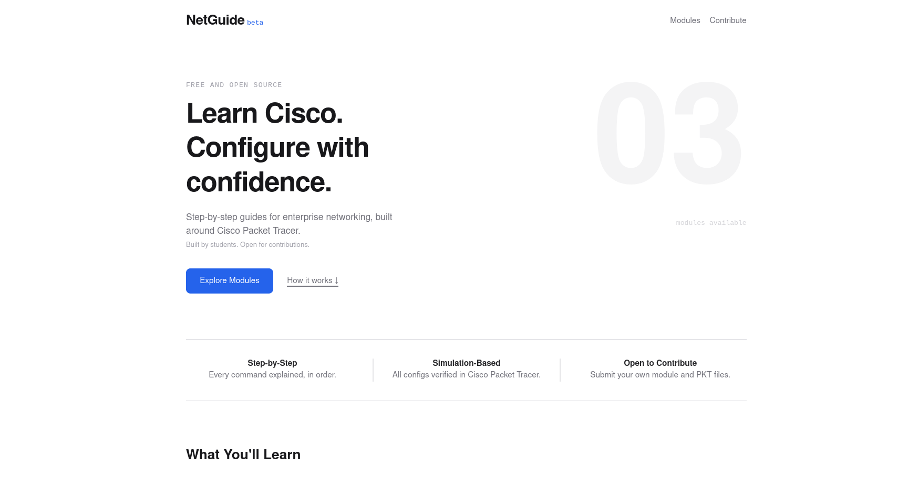
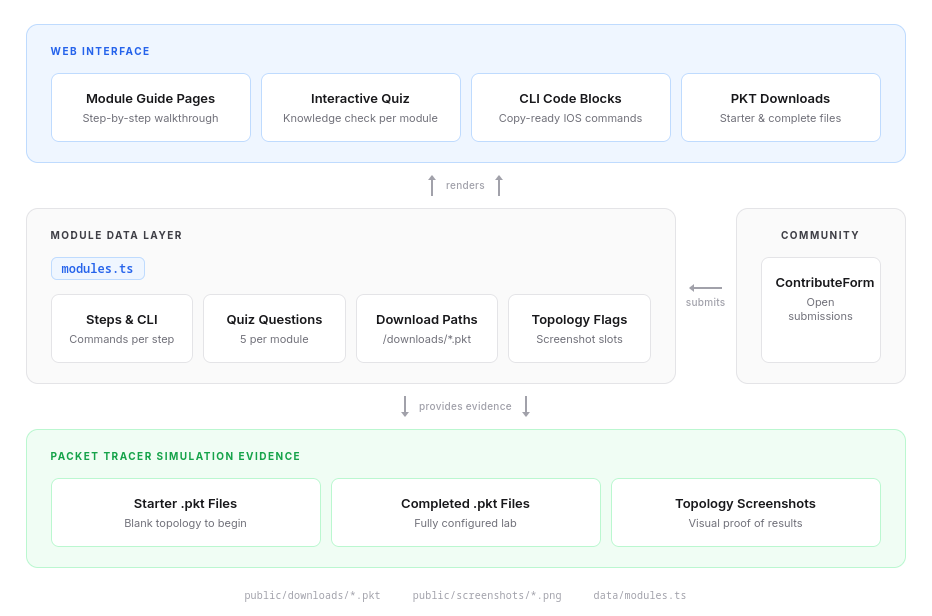

# NetGuide - Open Contribution Learning Platform

Interactive learning platform for Cisco enterprise networking.
Built for our CCNA Enterprise Networking project at IIUM KICT.



## Architecture



## Premade Modules

- Inter-VLAN Routing
- OSPF Dynamic Routing
- ACL Security

## Stack

Next.js 14, Tailwind CSS, deployed on Vercel.

## Running locally

```bash
npm install
npm run dev
```
